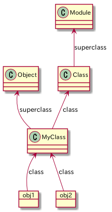

# 2章 オブジェクトモデル
## 2-1 オープンクラス

いつでも既存のクラスを再オープンしてその場で修正できる。

標準関数も簡単に書き換えることができるので、思わぬ副作用を生むこともある。

既存のコードにパッチを当てることを`モンキーパッチ`と呼ぶこともある。rubyでは副作用を生むモンキーパッチの代替として`Refinements`を用意しているが、全てを代替できるわけではない。

## 2-2 オブジェクトモデルの内部

*オブジェクトにインスタンス変数が含まれている*

```ruby
class MyClass
  def my_method
    @v = 1
  end
end

obj1 = MyClass.new
obj1.my_method
puts obj1.instance_variables.count() # 1

obj2 = MyClass.new
puts obj2.instance_variables.count() # 0
```

*メソッドはオブジェクトではなくクラスに存在する*

classで定義したメソッドはインスタンス化したオブジェクトで利用することができる。ゆえにメソッドはそのオブジェクトのクラスに住んでいると言える。

ただし、そのクラスを`methods`でイントロスペクションしても定義したメソッドは見えない。instance_methodsでイントロスペクトすると確認できる。

厳密には定義したメソッドは`インスタンスメソッド`と呼ぶ

```ruby
require "minitest/autorun"

class MyClass
  def my_method
    puts "yes my_method"
  end
end

class TestSample < Minitest::Test
  def setup
    @obj1 = MyClass.new
    @obj2 = MyClass.new
  end

  def test_obj
    assert_equal(MyClass, @obj1.class)
  end

  def test_2_1
    # オブジェクトはメソッドを持っている
    assert_equal([:my_method], @obj1.methods.grep(/my/))
  end

  def test_2_2
    # 共通のクラスを持つオブジェクトはメソッドも共通している。
    # つまり、メソッドはオブジェクトでなくクラスに存在する
    assert_equal([:my_method], @obj2.methods.grep(/my/))
  end

  def test_3_1
    # しかしMyClassはmy_methodを持っているとは言えない
    # ゆえに「my_methodはMyClassのインスタンスメソッド」と呼ぶ
    assert_equal([], MyClass.methods.grep(/my/))
  end

  def test_3_2
    assert_equal(String.instance_methods, "abc".methods)
    assert_equal(false, String.methods == "abc".methods)
  end

  def test_3_3
    assert_equal(MyClass.instance_methods, @obj1.methods)
    assert_equal(MyClass.instance_methods(false), [:my_method])
  end

end
```

### 2-2-2 クラスはオブジェクト

`test_2-2-2.rb`を参照のこと。

- クラスはClassクラスのオブジェクト
- オブジェクトのメソッドはそのクラスのインスタンスメソッド
- ClassクラスのスーパークラスはModule
- インクルードする場合はモジュールを使う
- インスタンスの生成や継承をするときはクラスを使う



### 2-2-3 定数

`test_2-2-3.rb`を参照のこと

- クラスの参照は変数に保持できる
- 大文字で始まる参照はクラス名やモジュール名も含めて全て定数
- 定数はファイルシステムのようなパスでアクセスできる
- ルートレベルのアクセスには`::`でアクセスする
- Module#constantsは現在のスコープにある定数を返す
  - lsコマンドと同等と思うとよい
- 定数をまとめるモジュールのことを`ネームスペース`と言ったりもする。

### 2-2-4 オブジェクトとクラス

- オブジェクトはインスタンス変数の集まりにクラスへのリンクがついたもの
  - オブジェクトのメソッドはクラスに住んでいる(クラスのインスタンスメソッド)
- クラスはオブジェクト(Classクラスのインスタンス)にインスタンスメソッドの一覧とスーパークラスへのリンクがついたもの
  
loadとrequire。loadは呼び出す度にファイルを実行するがrequireは1度したファイルを読み込まない。

## 2-3-1
rubyの世界では全てはオブジェクト。

オブジェクトはインスタンス変数の集まりにクラスへのリンクがついたもの。

クラスとはオブジェクト(Classクラスのインスタンス)にインスタンスメソッドの一覧とスーパークラスへのリンクがついたもの。


ClassクラスはModuleクラスに`new, allocate, superclass`メソッドを追加したもの

```
irb(main):002:0> Class.instance_methods(false)
=> [:new, :allocate, :superclass]
irb(main):003:0> Module.instance_methods == (Class.instance_methods - Class.instance_methods(false))
=> true
```

## 2-4-1 メソッド探索

- レシーパー
  - 呼び出すメソッドが属するオブジェクト
- 継承チェーン
  - クラスのsuperclassを辿っていく経路
  
### モジュールとメソッド探索

`test_2-4-1.rb`と`test_2-4-1_2.rb`を参照

- Moduleはinclude, prependすることができる
- prependしたmoduleは継承チェーンがincludeより手前になる
- 多重インクルードした場合、モジュールが既に継承チェーンに存在している場合は2回めの挿入は無視される
- KernelはModuleでObjectにincludeされている
- [awsome_print](https://github.com/awesome-print/awesome_print)のソースは参考になる。

## 2-4-2
Rubyのコードはオブジェクト(カレントオブジェクト)の内部で実行される。

カレントオブジェクトは`self`とも呼ばれる

メソッドを呼び出す時はメソッドのレシーバがselfになる

トップレベルコンテキストとはRubyのインタプリタが作った`main`と呼ばれるオブジェクトの内部にいることになる。

```
$ irb
irb(main):001:0> self
=> main
```

### privateメソッド