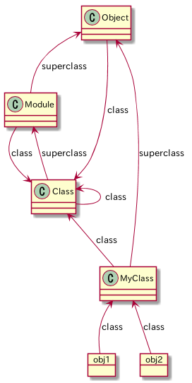

# 2章 オブジェクトモデル
## 2-1 オープンクラス

いつでも既存のクラスを再オープンしてその場で修正できる。

標準関数も簡単に書き換えることができるので、思わぬ副作用を生むこともある。

既存のコードにパッチを当てることを`モンキーパッチ`と呼ぶこともある。rubyでは副作用を生むモンキーパッチの代替として`Refinements`を用意しているが、全てを代替できるわけではない。

## 2-3-1
rubyの世界では全てはオブジェクト。

オブジェクトはインスタンス変数の集まりにクラスへのリンクがついたもの。

クラスとはオブジェクト(Classクラスのインスタンス)にインスタンスメソッドの一覧とスーパークラスへのリンクがついたもの。



ClassクラスはModuleクラスに`new, allocate, superclass`メソッドを追加したもの

```
irb(main):002:0> Class.instance_methods(false)
=> [:new, :allocate, :superclass]
irb(main):003:0> Module.instance_methods == (Class.instance_methods - Class.instance_methods(false))
=> true
```

## 2-4-2
Rubyのコードはオブジェクト(カレントオブジェクト)の内部で実行される。

カレントオブジェクトは`self`とも呼ばれる

メソッドを呼び出す時はメソッドのレシーバがselfになる

トップレベルコンテキストとはRubyのインタプリタが作った`main`と呼ばれるオブジェクトの内部にいることになる。

```
$ irb
irb(main):001:0> self
=> main
```

### privateメソッド