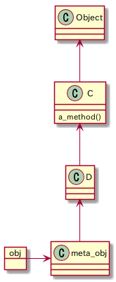

# クラス定義

クラスインスタンス変数とクラスのオブジェクトのインスタンス変数は別物

Javaのstaticフィールドっぽい用途の変数を使いたいなら`@@`を使ったクラス変数を定義することができる。

## 特異メソッド

下記のように単一のオブジェクトに特化したメソッドのことを`特異メソッド`という。

```ruby
str = "just a regular string"
def str.title?
  self.upcase == self
end
```

クラスの実体も単なるオブジェクト。クラス名は定数。

クラスメソッドの呼び出しはオブジェクトの呼び出しと同じもの。

```ruby
an_object.a_method
AClass.a_class_method
```

クラスメソッドはクラスの特異メソッド。

特異メソッドをdefを使って定義する構文は常にこうなる

```ruby
def object.method
  # 中身
end
```

## 特異クラス

特異クラスとは、あるクラスのインスタンスがその裏に特別に持つメタクラス、シングルトンクラスのこと

```ruby
class C
end

obj = C.new
class << obj
  def sample
    'sample'
  end
end

assert(obj.singleton_class.superclass == C)
```

次のようなメソッド探索になる


